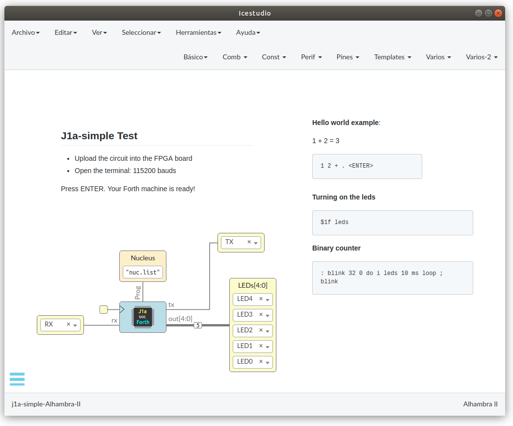

# SwapForth J1a-ICestudio
  SwapForth J1a processor for Icestudio

Use the [J1a Forth processor](https://www.excamera.com/sphinx/article-j1a-swapforth.html) very easily!

The j1a-simple is a modified version of the J1a:
* It can be opened with the [Icestudio](https://icestudio.io/) open source visual editor
* Baudrate: 115200
* Clock frequency: 12Mhz (no PLL)
* No DTR used

It can be synthesized on any of the supported boards with **OpenFPGAs**, althout in this repo there are only example for the following boards:  
  * [Alhambra II](https://github.com/FPGAwars/Alhambra-II-FPGA/wiki)
  * Icestick
  * BlackIce II

## Quick start

* Open the **j1a-simple-Alhambra-II.ice** file with Icestudio (5.1 or higher). Depending on the board, it is located in the folders j1a-AlhambraII or j1a-icestick (if you have another board just choose anyone and change the input/outpus)




* Connect the Alhambra-II board (or compatible board) and upload the design
* Open a serial terminal (115200 bauds) (You can use the one available inside icestudio (0.5.1-dev or higher) or an external one)
* Press the ENTER key. You will see the **ok message**
* Your Forth environment is ready!!

## Hello world examples!

From the terminal, type the following Forth examples:

* Calculating 1 + 2

```
1 2 + .
```

* Turning on the leds

```
$1f leds
```

* Binary counter

```
: counter 32 0 do i leds 10 ms loop ;
counter
```

### Vídeo

[](https://www.youtube.com/watch?v=I-QJlhb5YSo)]

## Credits

* [Project SwapForth](https://github.com/jamesbowman/swapforth) By James Bowman. Thanks a lot for this awesome project. The J1a processor was the first i tried with the icestorm open source tools. I learnt a lot and it was a source of inspiration
